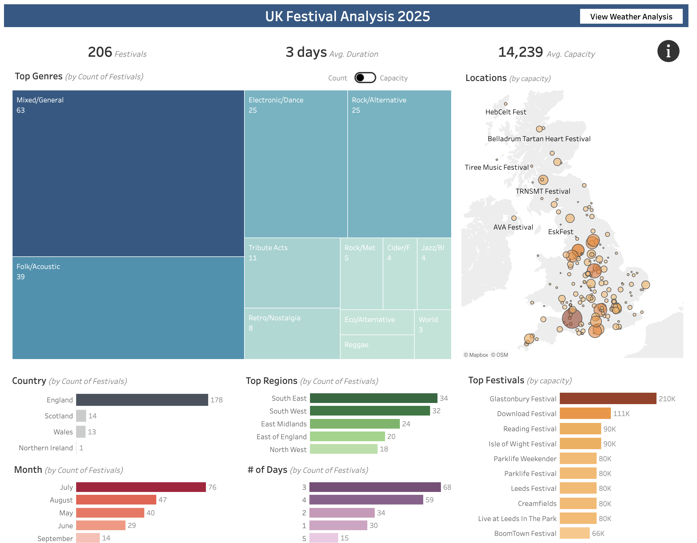
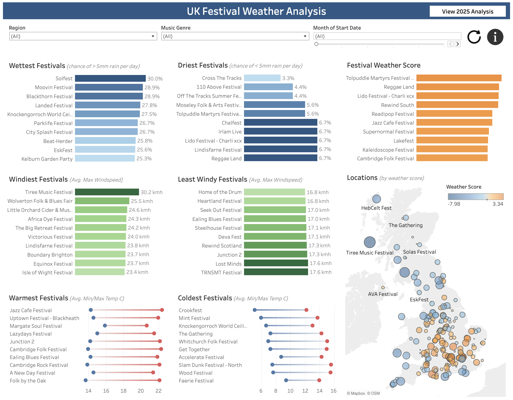

# UK Festival Analysis
A comprehensive analysis of 206 UK festivals combining web scraping, data engineering, and weather analysis to create interactive visualizations.

## Skills Demonstrated
- Web Scraping & Data Collection
- Data Cleaning & Transformation
- API Integration
- Statistical Analysis
- Geographic Data Processing
- Data Visualization

## Overview
An analysis of UK festivals in 2025, demonstrating end-to-end data analysis capabilities. The project combines festival data scraped from the internet with 30 years of historical weather data to provide insights into the UK festival landscape and predict optimal festival experiences based on historical weather patterns.

## Tools Used
- Data Collection: Screaming Frog
- Data Processing: Google Sheets, Python (Pandas, NumPy, SciPy)
- API Integration: Open-Meteo Weather API
- Development: R Studio
- Visualization: Tableau

## Data Processing Methodology
1. **Data Collection & Cleaning**
   - Scraped festival details using Screaming Frog with custom extracts
   - Processed raw data using regex to extract key data points
   - Geocoded locations using SmartMonkey
   - Augmented dataset with AI-assisted categorization (validated manually)

2. **Weather Data Integration**
   - Developed Python scripts to collect 30 years of historical weather data
   - Created aggregated weather metrics and scoring system
   - Generated comprehensive weather analysis per festival

## Key Insights
- Market Analysis:
  - Mixed/general is the leading genre with 63 festivals (1.3 million capacity)
  - July hosts most festivals (76), but August has highest capacity (885k)
  - South East England leads with 34 festivals (580k capacity)
  - Typical festival duration is 3 days

- Weather Analysis:
  - Driest: Cross the Tacks (3.3% chance of significant rainfall)
  - Most Stable Wind: Home of the Drum (16.8kmh avg. max wind)
  - Warmest: Jazz Cafe Festival (14.3C-22.4C temperature range)
  - Best Overall Weather: Tolpuddle Martyrs Festival and Rally

## Visualizations
Interactive Tableau dashboards presenting market and weather insights:

*Dashboard 1: UK Festival Market Analysis 2025*

*Dashboard 2: Historical Weather Analysis by Festival Location*

[View Interactive Dashboards on Tableau Public ↗](https://public.tableau.com/app/profile/dom.barry/viz/UKFestivalAnalysis2025/FestivalAnalysis)

