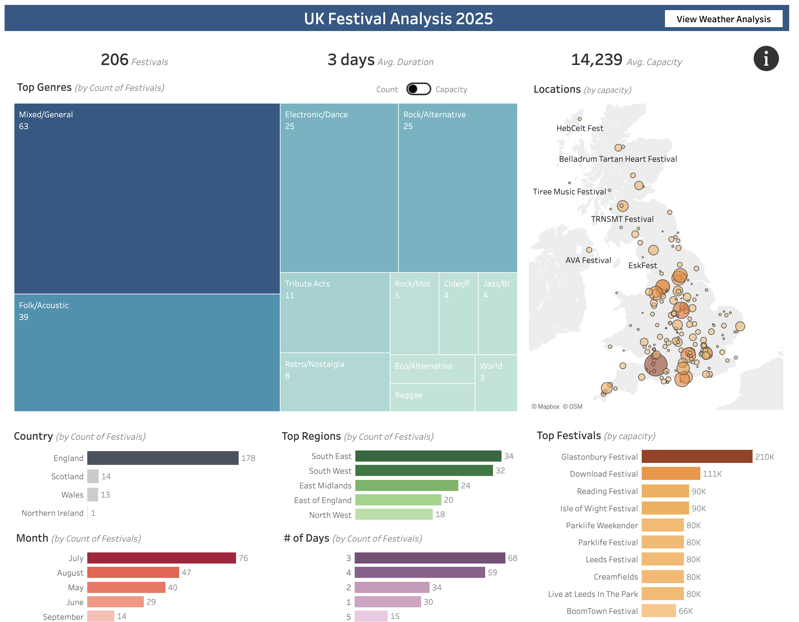

# UK Festival Analysis
A comprehensive analysis of 206 UK festivals in 2025, combining web scraped festival data with 30 years of historical weather patterns to provide insights and predict optimal festival experiences through interactive visualizations.

## Overview

- Festival info scraped from the internet, extracted, cleaned, augmented, geocoded
- Geocoded weather data sourced from Open-Meteo.com
- Screaming Frog, Google Sheets, Geocoding by SmartMonkey, Claude.ai, R, Python & Tableau used
- It was then imported into Tableau & augmented with calculated fields to support further analysis

## Data Structure

The database structure as seen below consists of 3 tables, 'UK Festivals', 'Weather Data' and 'Weather Comparison':

The steps taken to process the data prior to analysis in Tableau can be found [here](documentation/data-prep-summary.md).

## Methodology

- Web Scraping & Data Collection
- Data Cleaning & Transformation
- API Integration
- Statistical Analysis
- Geographic Data Processing
- Data Visualization using Tableau

## Tools Used

- Data Collection: Screaming Frog
- Data Processing: Google Sheets, Python (Pandas, NumPy, SciPy)
- API Integration: Open-Meteo Weather API
- Development: R Studio
- Visualization: Tableau

## Dashboard Structure

### 1. Festival Market Overview Dashboard

#### Key Metrics (BANs)

- **Total festivals** (206)
- **Average duration** (3 days)
- **Average capacity** (14,239)

#### Market Segmentation Visualizations

- **Top Genres** treemap showing distribution by count/capacity (Mixed/General leading with 63 festivals)
- **UK Map** showing geographic distribution of festivals with size/color indicating capacity
- **Country breakdown** bar chart showing England (178) dominates with Scotland (14) and Wales (13) following
- **Top Regions** bar chart highlighting South East (34) and South West (32) as leading areas
- **Month distribution** bar chart showing July (76) and August (47) as peak festival months
- **Duration distribution** showing 3-day festivals (68) are most common
- **Top Festivals** by capacity bar chart with Glastonbury (210K) leading

### 2. Weather Analysis Dashboard

#### Filter Controls
- **Region dropdown** for geographic filtering
- **Music Genre dropdown** for genre-specific analysis
- **Month slider** for temporal filtering

#### Weather Metric Comparisons
- **Wettest Festivals** bar chart showing rainfall probability (Solfest at 30.0%)
- **Driest Festivals** bar chart showing minimal rainfall chance (Cross The Tracks at 3.3%)
- **Windiest Festivals** bar chart showing average max windspeed (Tiree Music Festival at 30.2 kmh)
- **Least Windy Festivals** bar chart (Home of the Drum at 16.8 kmh)

#### Temperature Analysis
- **Warmest Festivals** dot plot showing min/max temperature ranges (Jazz Cafe Festival leading)
- **Coldest Festivals** dot plot showing min/max temperature ranges

#### Summary Metrics
- **Festival Weather Score** bar chart ranking overall weather quality (Tolpuddle Martyrs Festival leading)
- **Weather Map** showing geographic distribution of festivals with color-coded weather scores

#### Filter Controls

- **Region dropdown** for geographic filtering
- **Music Genre dropdown** for genre-specific analysis
- **Month slider** for temporal filtering

#### Weather Metric Comparisons

- **Wettest Festivals** bar chart showing rainfall probability (Solfest at 30.0%)
- **Driest Festivals** bar chart showing minimal rainfall chance (Cross The Tracks at 3.3%)
- **Windiest Festivals** bar chart showing average max windspeed (Tiree Music Festival at 30.2 kmh)
- **Least Windy Festivals** bar chart (Home of the Drum at 16.8 kmh)

#### Temperature Analysis

- **Warmest Festivals** dot plot showing min/max temperature ranges (Jazz Cafe Festival leading)
- **Coldest Festivals** dot plot showing min/max temperature ranges

#### Summary Metrics

- **Festival Weather Score** bar chart ranking overall weather quality (Tolpuddle Martyrs Festival leading)
- **Weather Map** showing geographic distribution of festivals with color-coded weather scores

## Key Findings

- Market Analysis:
  - Mixed/general is the leading genre with 63 festivals (1.3 million capacity)
  - July hosts most festivals (76), but August has highest capacity (885k)
  - South East England leads with 34 festivals (580k capacity)
  - Typical festival duration is 3 days

- Weather Analysis:
  - Driest: Cross the Tacks (3.3% chance of significant rainfall)
  - Most Stable Wind: Home of the Drum (16.8kmh avg. max wind)
  - Warmest: Jazz Cafe Festival (14.3C-22.4C temperature range)
  - Best Overall Weather: Tolpuddle Martyrs Festival and Rally

## How to view the dashboard

*Dashboard 1: UK Festival Market Analysis 2025*

*Dashboard 2: Historical Weather Analysis by Festival Location*

[View Interactive Dashboards on Tableau Public ↗](https://public.tableau.com/app/profile/dom.barry/viz/UKFestivalAnalysis2025/FestivalAnalysis)

## Caveats & Assumptions

Festival specifc information was scraped from 3rd party sites on the internet & is not guaranteed to be reliable but does provide a reasonable data set for analysis. It would be very interesting to repeat this analysis using first party data from industry bodies and/or licensing authorities.